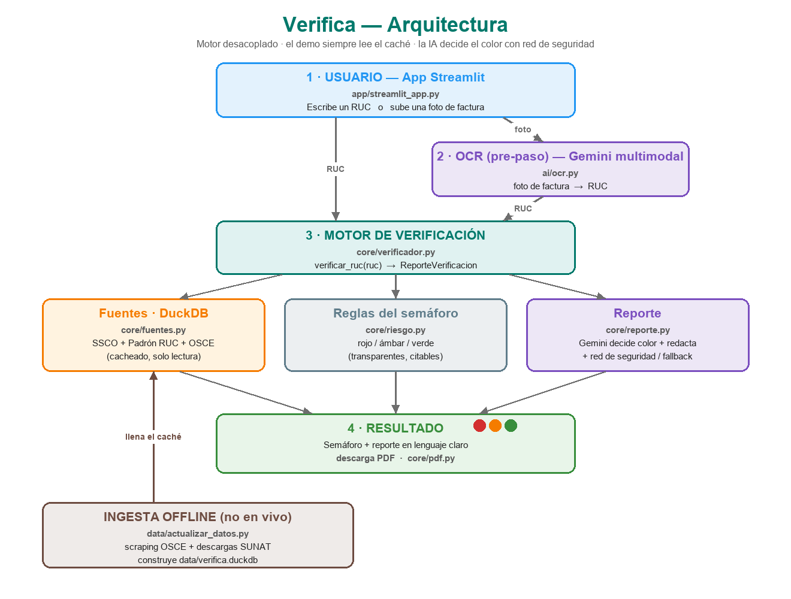

# 🛡️ Verifica

> Verifica le dice a cualquier MYPE peruana, en 30 segundos y con solo un RUC, si la empresa con la que va a hacer negocios es **legítima o un riesgo de fraude** — cruzando empresas fantasma de SUNAT (SSCO), sanciones del Estado (OSCE) y el estado del RUC, que hoy están dispersos en varios portales.

**Proyecto final — Data Science con Python (Universidad del Pacífico, 2026-I).**
Founder (solo founder): **Diego Turpo de la Cruz**.

- 🌐 **Demo en vivo:** **<https://verifica-pe-decxqbd2bdqkst72icv6qr.streamlit.app>** — ingresa un RUC; no requiere instalar nada ni iniciar sesión.
- 🎥 **Video demo (2-3 min):** ver [`docs/video_demo.md`](docs/video_demo.md)
- 📊 **Pitch deck:** [`docs/pitch_deck.pdf`](docs/pitch_deck.pdf)  ·  📐 **Arquitectura:** [`docs/arquitectura.png`](docs/arquitectura.png)  ·  🔎 **Evidencia:** [`docs/research/`](docs/research/)

---

## El problema (validado con data oficial)

Según SUNAT (relación al 31-dic-2025), **78 empresas fantasma (SSCO)** emitieron **~455 mil facturas falsas** a **57,804 clientes**, llevando a que SUNAT desconociera más de **S/ 3,195 millones** en crédito fiscal y gasto. **39,177 de los afectados pertenecen al Régimen MYPE Tributario** — el daño cae sobre las pequeñas empresas.

La información que delata a estas empresas **ya es pública y gratuita**, pero está **fragmentada en seis portales que nadie cruza**. Verifica los cruza por ti.

_Evidencia y fuentes completas en [`docs/research/`](docs/research/)._

## Cómo funciona

Ingresas un RUC (escrito o desde una foto de factura) → Verifica arma el perfil cruzando fuentes públicas → devuelve un **semáforo de riesgo** con **reglas transparentes** y un **reporte en lenguaje claro**:

- 🔴 **Rojo:** figura en lista SSCO, RUC de baja / no habido, o inhabilitado vigente en OSCE.
- 🟡 **Ámbar:** señales de precaución (p. ej. sanción OSCE histórica no vigente).
- 🟢 **Verde:** activo, habido, sin SSCO ni sanciones.

> El semáforo se apoya en **reglas transparentes** (`core/riesgo.py`): figurar en SSCO, RUC no habido / de baja o inhabilitación OSCE vigente **fuerzan rojo**. Gemini decide el color usando esas reglas como criterio y redacta el reporte, con una **red de seguridad** que nunca rebaja a verde un caso confirmado (con *fallback* por reglas si no hay clave o falla la API).

## Arquitectura

Motor de verificación **desacoplado** (Python puro): `verificar_ruc(ruc) -> ReporteVerificacion`. Streamlit solo lo invoca y pinta. Los datos viven **cacheados en DuckDB** → consulta rápida y sin scraping en vivo durante el demo.

```
[Streamlit]  --verificar_ruc()-->  [Motor de verificación]
                                        |--> [DuckDB] padrón RUC + SSCO + OSCE (lectura cacheada)
                                        \--> [Gemini] decide el color + redacta
  [OCR Gemini multimodal]  foto factura --> RUC --> Motor
[data/actualizar_datos.py]  descargas SUNAT + scraper OSCE  (offline, fuera del demo)
```



## Herramientas del curso usadas

| # | Herramienta (lección) | Dónde en el código |
|---|---|---|
| 1 | Ingesta web / scraping (Lec. 2-3) | [`data/actualizar_datos.py`](data/actualizar_datos.py) |
| 2 | LLM vía API (Lec. 9) | [`core/reporte.py`](core/reporte.py) — Gemini redacta el reporte |
| 3 | Document AI / OCR (Lec. 14) | [`ai/ocr.py`](ai/ocr.py) — Gemini multimodal extrae el RUC de la factura |

> Las clases mostraron que el OCR/LLM puede implementarse con distintas APIs (Claude, Gemini, etc.). Se eligió **Gemini Flash** por su tier gratuito, suficiente para el demo, manteniendo el deploy ligero.

## Desarrollo asistido por IA

Este proyecto se construyó con **Claude Code** (el agente de código de Anthropic) como
copiloto técnico, bajo la dirección del founder. La IA ayudó a escribir y refactorizar el
motor (`core/`), la ingesta (`data/actualizar_datos.py`), la app (`app/`), el OCR
(`ai/ocr.py`), los tests y la documentación. **Todas las decisiones de producto,
arquitectura, fuentes de datos y reglas del semáforo las tomó el founder**, que entiende y
puede explicar o modificar cada parte del repo — las reglas de riesgo (`core/riesgo.py`)
son transparentes y auditables justamente para poder sustentarlas.

## Cómo correr localmente

```bash
pip install -r requirements.txt
cp .env.example .env          # coloca tu GEMINI_API_KEY
streamlit run app/streamlit_app.py
```

Consigue una API key gratis de Gemini en <https://aistudio.google.com/apikey>.

## Estructura del repositorio

```
verifica-pe/
├── app/        # interfaz Streamlit (input RUC + subir factura)
├── core/       # motor: verificador, fuentes (DuckDB), riesgo (reglas), reporte (LLM), pdf
├── ai/         # OCR con Gemini multimodal (ocr.py)
├── data/       # actualizar_datos.py (offline) + verifica.duckdb (muestra ligera)
├── docs/       # pitch_deck.pdf, arquitectura.png, video_demo.md, research/ (evidencia)
├── notebooks/  # exploracion.ipynb (EDA de las 3 fuentes)
└── tests/      # pruebas del motor (pytest)
```

## Datos y fuentes

- **Padrón RUC** (SUNAT, datos abiertos) — estado y condición.
- **Relación de Sujetos Sin Capacidad Operativa (SSCO)** (SUNAT, D.L. 1532) — empresas fantasma.
- **Proveedores sancionados / inhabilitados** (OSCE / RNP).

El demo usa una **muestra ligera** cacheada en DuckDB. En producción el padrón completo vive en una base en la nube; el motor no cambia una línea.

## Licencia

MIT — ver [LICENSE](LICENSE).
